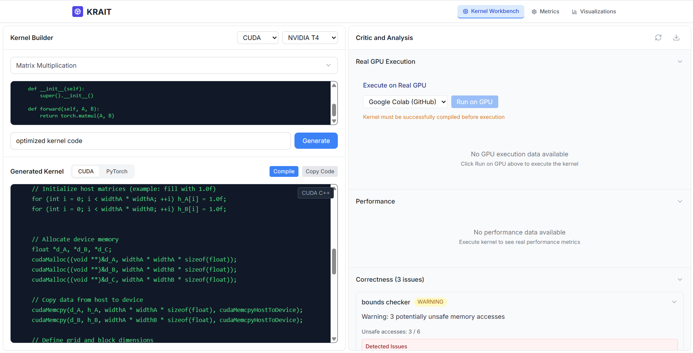

# KRAIT - Kernel Review, Analysis, and Intelligent Tuning

An advanced GPU kernel analysis and optimization platform that combines static code analysis with AI-powered insights to help developers write better, more efficient GPU kernels. KRAIT provides comprehensive correctness checking, performance analysis, and intelligent suggestions for CUDA, Triton, and OpenCL kernels.

## 🎥 Demo Video

[](./assets/KRAIT_Demo_Sped.mp4)

<div style="position: relative; padding-bottom: 56.25%; height: 0;"><iframe src="https://www.veed.io/embed/ea9014c3-0182-433d-847b-5fe300958033" style="position: absolute; top: 0; left: 0; width: 100%; height: 100%;" frameborder="0" title="Krait" allow="accelerometer; autoplay; clipboard-write; encrypted-media; gyroscope; picture-in-picture" allowfullscreen></iframe></div>

**Watch the full demo** to see KRAIT in action:
- AI-powered kernel generation and analysis
- Real-time GPU execution on Google Colab
- Interactive workbench with live suggestions
- Performance metrics and optimization recommendations


## 🚀 Features

### Core Analysis Capabilities
- **Correctness Analysis**: Comprehensive bounds checking, memory safety, type safety, and synchronization analysis
- **Performance Analysis**: FLOPs calculation, memory usage estimation, runtime prediction, and efficiency scoring
- **AI-Powered Code Review**: Advanced LLM-based analysis using Google Gemini for complex code patterns
- **Multi-Backend Support**: Full support for CUDA, Triton, and OpenCL kernels
- **Hardware-Aware Optimization**: Tailored suggestions for different GPU architectures (NVIDIA A100/H100, AMD MI300X)

### Advanced Features
- **Kernel Code Generation**: Generate optimized GPU kernels with AI assistance
- **Real-time GPU Execution**: Execute kernels on actual GPU hardware via Google Colab integration
- **Interactive Workbench**: Web-based interface for kernel development and analysis
- **Performance Metrics Dashboard**: Visualize kernel performance across different hardware configurations
- **Automated Code Fixing**: AI-powered suggestions to fix compilation errors and improve performance
- **Batch Analysis**: Analyze multiple kernels simultaneously

### Analysis Modules
- **Bounds Checker**: Detects unsafe memory accesses and suggests proper bounds checking
- **Memory Safety Checker**: Identifies memory leaks, buffer overflows, and unsafe memory patterns
- **Synchronization Checker**: Ensures proper thread synchronization and race condition prevention
- **Type Safety Checker**: Validates type usage and prevents type-related bugs
- **Performance Checker**: Analyzes computational efficiency and memory utilization
- **Vectorization Checker**: Identifies vectorization opportunities
- **Tiling Detector**: Detects and analyzes memory tiling patterns

## 🏗️ Architecture

### Frontend (Next.js + TypeScript)
- **Kernel Workbench**: Interactive code editor with syntax highlighting
- **Critic Panel**: Real-time analysis results and suggestions
- **Metrics Dashboard**: Performance visualization and historical data
- **Chat Interface**: AI-powered assistance for kernel development

### Backend (FastAPI + Python)
- **Analysis Engine**: Modular checker system for kernel correctness
- **LLM Integration**: Google Gemini and Hugging Face model support
- **GPU Executor**: GitHub-Colab integration for real kernel execution
- **RESTful API**: Comprehensive API for all analysis features

### GPU Execution Pipeline
- **GitHub Integration**: Automatic kernel deployment to Google Colab
- **Real-time Monitoring**: Live execution status and result collection
- **Performance Metrics**: Actual GPU utilization and timing data
- **Error Handling**: Comprehensive error detection and recovery

## 📋 Prerequisites

- **Node.js** 18+ and npm
- **Python** 3.11+
- **Git** for version control
- **Google Colab** account (for GPU execution)
- **GitHub** account (for kernel storage and execution)

## 🛠️ Installation & Setup

### 1. Clone the Repository
```bash
git clone https://github.com/kcharvi/KRAIT.git
cd KRAIT
```

### 2. Backend Setup
```bash
cd backend

# Create virtual environment
python -m venv venv
source venv/bin/activate  # On Windows: venv\Scripts\activate

# Install dependencies
pip install -r requirements.txt

# Set up environment variables
cp env.example .env
# Edit .env with your API keys and configuration
```

**Required Environment Variables:**
```env
# Gemini API (for AI analysis)
GEMINI_API_KEY=your_gemini_api_key

# GitHub Integration (for GPU execution)
GITHUB_TOKEN=your_github_token
GITHUB_OWNER=your_github_username
GITHUB_REPO_NAME=KRAIT

# Optional: Hugging Face (alternative AI provider)
HUGGINGFACE_API_KEY=your_huggingface_token
```

### 3. Frontend Setup
```bash
cd frontend

# Install dependencies
npm install

# Set up environment variables
cp env.local.example .env.local
# Edit .env.local with your backend URL
```

**Frontend Environment Variables:**
```env
NEXT_PUBLIC_API_URL=http://localhost:8000
```

### 4. GPU Executor Setup (Optional)
```bash
cd gpu-executor

# Install Python dependencies
pip install -r requirements.txt

# Follow SETUP.md for detailed Colab configuration
```

## 🚀 Getting Started

### 1. Start the Backend
```bash
cd backend
python -m uvicorn app.main:app --reload --host 0.0.0.0 --port 8000
```

### 2. Start the Frontend
```bash
cd frontend
npm run dev
```

### 3. Access the Application
- **Frontend**: http://localhost:3000
- **Backend API**: http://localhost:8000
- **API Documentation**: http://localhost:8000/docs

## 📖 Usage Guide

### Basic Kernel Analysis
1. **Open the Kernel Workbench** in your browser
2. **Select your backend** (CUDA, Triton, or OpenCL)
3. **Choose target hardware** (NVIDIA T4, A100, H100, etc.)
4. **Write or paste your kernel code**
5. **Click "Analyze"** to run comprehensive analysis
6. **Review results** in the Critic Panel

### AI-Powered Code Generation
1. **Navigate to the Kernel Generation tab**
2. **Describe your problem** (e.g., "matrix multiplication for 1024x1024 matrices")
3. **Select backend and hardware**
4. **Generate optimized kernel** with AI assistance
5. **Analyze and refine** the generated code

### Real GPU Execution
1. **Ensure GitHub integration is configured**
2. **Write your kernel code**
3. **Click "Execute on GPU"** to run on actual hardware
4. **Monitor execution** in real-time
5. **View performance metrics** and results

### Performance Analysis
1. **Access the Metrics Dashboard**
2. **View historical performance data**
3. **Compare kernels across different hardware**
4. **Export data** for further analysis

## 🔧 API Usage

### Analyze a Kernel
```bash
curl -X POST "http://localhost:8000/critic/analyze" \
  -H "Content-Type: application/json" \
  -d '{
    "kernel_code": "__global__ void matrixMul(float* A, float* B, float* C, int N) { ... }",
    "hardware": "NVIDIA A100",
    "backend": "CUDA"
  }'
```

### Generate a Kernel
```bash
curl -X POST "http://localhost:8000/kernel/generate" \
  -H "Content-Type: application/json" \
  -d '{
    "backend": "CUDA",
    "hardware": "NVIDIA A100",
    "code": "// Matrix multiplication kernel",
    "user_prompt": "Optimize for memory bandwidth",
    "problem_name": "Matrix Multiplication"
  }'
```

### Execute on GPU
```bash
curl -X POST "http://localhost:8000/gpu/execute-kernel" \
  -H "Content-Type: application/json" \
  -d '{
    "kernel_code": "__global__ void matrixMul(...) { ... }",
    "hardware": "NVIDIA T4",
    "provider": "github_colab"
  }'
```

## 📊 Analysis Results

### Correctness Analysis
- **Bounds Checking**: Identifies unsafe array accesses
- **Memory Safety**: Detects memory leaks and buffer overflows
- **Synchronization**: Ensures proper thread coordination
- **Type Safety**: Validates type usage and conversions

### Performance Analysis
- **FLOPs Calculation**: Theoretical floating-point operations
- **Memory Usage**: Estimated memory consumption
- **Runtime Prediction**: Expected execution time
- **Efficiency Score**: Overall performance rating (0-100)

### Suggestions
- **Critical**: Fixes for correctness issues
- **High**: Important performance optimizations
- **Medium**: General improvements
- **Low**: Minor optimizations

## 🎯 Supported Hardware 

### ✅ **Fully Supported (Analysis + Execution)**
- **NVIDIA T4**: Entry-level development and testing via Google Colab
- **CPU**: Fallback option for analysis and testing

### ⚠️ **Analysis Only (No Real Execution)**
- **NVIDIA A100**: High-performance computing (analysis + specs)
- **NVIDIA H100**: Latest generation with advanced features (analysis + specs)
- **NVIDIA V100**: Data center GPU (analysis + specs)
- **NVIDIA RTX 4090**: Consumer GPU (analysis + specs)
- **AMD MI300X**: High-performance data center GPU (analysis + specs)
- **AMD MI250X/MI200**: Data center GPUs (analysis + specs)

*Real execution requires actual hardware access. Analysis works for all listed hardware.*

## 🔌 Supported Backends

### ✅ **Fully Supported (Analysis + Execution)**
- **CUDA C++**: Traditional CUDA kernel development with real GPU execution
- **PyTorch CUDA**: Python-based CUDA extensions with real GPU execution

### ⚠️ **Analysis Only (No Real Execution)**
- **Triton**: Python-based high-level kernel development (analysis + parsing)
- **OpenCL**: Cross-platform multi-vendor GPU support (analysis + parsing)

### 🔧 **Advanced Features (Analysis Only)**
- **CUDA Templates**: Generic programming support (analysis)
- **Tensor Cores**: Mixed-precision acceleration (analysis)
- **Multi-GPU Triton**: Distributed computing (analysis)

## 🔄 Changelog

### v1.0.0
- Initial release with core analysis capabilities
- CUDA, Triton, and OpenCL support
- AI-powered code generation and analysis
- Real-time GPU execution via Colab integration
- Comprehensive web interface

---

**KRAIT** - Making GPU kernel development smarter, safer, and more efficient! 🚀

